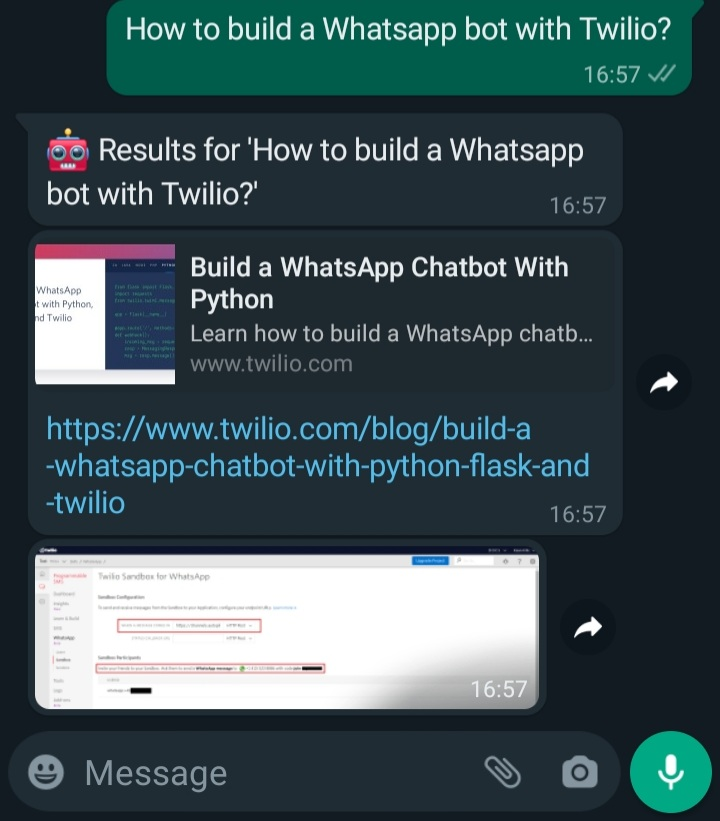

# Whatsapp bot using Flask, Twilio, BeautifulSoup, and google-search

## Overview

This repository contains a Whatsapp chatbot example using Flask, Twilio API, and web scraping libraries such as BeautifulSoup and google-search.

### Description

In this project, a query on Google is run based on a Whatsapp message sent to a Twilio's Sandbox test number. Besides, the message is used to search for images on Bing. Finally, a Whatsapp response message containing links and images from the results is sent.

### Whatsapp message and response example

## Extras

Web scraping scripts for searching and dowloading images have been included in the 'utils' folder. Each script is a different method to scrape images from Bing (original size images), Google (only thumbnails), and a third method using Selenium webdriver for Chrome (original size images).

## References

- Build a WhatsApp Chatbot With Python. Twilio. https://www.twilio.com/blog/build-a-whatsapp-chatbot-with-python-flask-and-twilio
- Bing Image Scraper Example. Stephen Houser. https://gist.github.com/stephenhouser/c5e2b921c3770ed47eb3b75efbc94799
- Building WhatsApp bot on Python. GeeksforGeeks. https://www.geeksforgeeks.org/building-whatsapp-bot-on-python/
